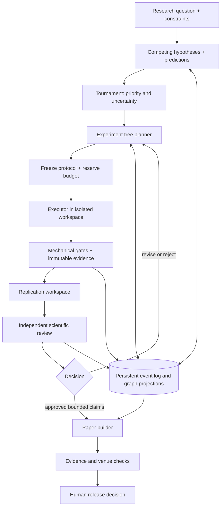

# EpistemeOS: архитектура исследовательского harness

Статус: **архитектура v0.1 и локальный прототип; полный автономный цикл ещё не реализован**. Архитектура подготовлена 6 сентября, статус кода обновлён 23 сентября 2026. Основания: [сохранённый контекст](../objective.md), задача «Агентские научные исследования», [аудит afterlife](research/afterlife-audit.md), [AI Scientist / Co-Scientist](research/ai-scientist-coscientist.md), [Kosmos / Virtual Lab / Robin](research/kosmos-virtual-lab-robin.md).

## 1. Решение

Строить отдельный framework с подключаемыми научными domain packs. `llm-semantic-afterlife` станет первым адаптером и исследовательским кейсом; его предметная модель LLM dynamics не войдёт в универсальное ядро. Scientific workflow будет управляться типизированными командами и проверяемыми состояниями. LLM предлагает действия и интерпретации; kernel проверяет разрешения, ссылки, бюджет и условия перехода.

Целевой результат исследования — reviewable research package: постановка вопроса, альтернативные объяснения, история поиска, frozen protocols, код/среда/данные, успешные и неуспешные runs, bounded claims, независимые проверки и manuscript с трассируемыми утверждениями. Принятие TMLR/ICLR остаётся внешним результатом, который нужно измерять, а не системным статусом.

В первой реализации используем Python 3.11+, SQLite, content-addressed files и JSONL export. Нет необходимости сразу вводить graph database, распределённый workflow engine, веб-интерфейс или зависимость от конкретного LLM orchestration SDK. Граница интерфейсов позволит добавить их после проверки ядра.

## 2. Что меняется относительно сохранённого контекста

Контекст верно выделяет дисциплину afterlife, но сравнительные заявления о превосходстве над другими системами пока не подтверждены. Локальный аудит выявил декларативную preregistration, некоторые допускающие пропуск проверки gates и CLI reproduce, печатающий команды. Эти механизмы нельзя переносить как доказанные гарантии.

Публикации систем, публикации результатов с их участием и принятие автоматически написанных papers — разные исходы. AI Scientist имеет workshop-level эксперимент с человеческим отбором; он не устанавливает надёжность main-track. У AI Co-Scientist теперь есть [расширение 27.08.2026](https://arxiv.org/html/2608.26701v1), которое уже соединяет гипотезы, исполнение и manuscript; это свежий препринт с сохраняющимися методологическими ошибками. В Robin люди выполняли эксперименты и участвовали в протоколах/написании. Детали, версии и ограничения раскрыты в отдельных обзорах.

## 3. Три разных пространства состояния

| Структура | Вопрос, на который отвечает | Что в ней хранится |
|---|---|---|
| Hypothesis / explanation graph | Что могло вызвать наблюдение и чем объяснения различимы? | Версии гипотез, null/confound/artifact alternatives, предсказания, литература, provenance, tournament ballots |
| Experiment search tree | Какой проверочный шаг выполнить дальше? | Родитель, действие, expected information, стоимость, protocol version, runs, технический и научный исход |
| Claim–evidence graph | Что установлено, на каких данных и в какой области? | Наблюдения, claims, supports/contradicts, методы измерения, условия применимости, ограничения, reviews, revisions |

Рейтинг гипотезы не меняет статус claim. Debug/retry-узел не добавляет независимое evidence. Несколько анализов одной выборки не превращаются в несколько независимых выборок. Противоречия хранятся явно; summary никогда не заменяет первичные свидетельства.

## 4. Данные и ссылки

Целевая модель связывает все идентификаторы со study. Записи версионируются; изменения создают новые версии с parent/supersedes и основанием. Сейчас опубликованы JSON schemas command envelope, statistical design, ResearchQuestion, ExplanationSet, claim link v1 и review с оценками связей v2. Между claims реализованы `supports`, `contradicts`, `limits`, `supersedes`; остальные entity schemas остаются в M1. Bound planning study сверяется с command context, но это metadata consistency, не граница доступа.

| Сущность | Основные поля и инварианты |
|---|---|
| ResearchQuestion | Область, цель, ограничения, доступные данные, бюджет, критерии остановки, domain pack version |
| ExplanationSet / HypothesisVersion | Наблюдение, механизм, falsifier, ожидаемые исходы, конкуренты, происхождение идеи, scope |
| Source / LiteratureClaim | DOI/URL/version, дата получения, локатор доказательства, проверенные метаданные; наличие DOI не доказывает интерпретацию |
| TournamentBallot | Версии кандидатов, порядок A/B, rubric/judge/model/prompt versions, verdict/tie/abstain, rationale, source IDs |
| ExperimentSpec / Protocol | Различаемые гипотезы, primary/secondary metrics, единица наблюдения, controls, split IDs, seed schedule, sample size/power rationale, exclusions, analysis и stopping rules |
| Preregistration | Canonical spec hash, code/environment/data snapshots, время регистрации, causation IDs; amendments не переписывают прошлое |
| ExperimentNode | Parent, edge type, protocol, search score/components, cost estimate, chosen/rejected reason; дерево выбора отдельно от DAG зависимости артефактов |
| Run / Attempt | Protocol hash, argv/config, seed, source commit+dirty patch hash, image/lock digest, hardware/provider fingerprint, времена, exit status, usage ledger |
| Artifact / Observation | Digest, media type, producer run, schema/units, metric pipeline; numeric result из raw data, не из narrative |
| Claim / EvidenceLink | Statement, descriptive/causal/etc type, scope, outcome, evidence IDs, relation, assumptions, confounds, uncertainty, limitations |
| ReplicationReport | Target, mode, independently authored code, context bundle digest, agreement criterion, outcome и dependencies |
| Review / Decision | Reviewer assignment, immutable evidence basis, findings, severity, blocking actions, verdict, rationale; старый review не покрывает новые evidence |
| PaperBundle | Claim and figure versions, bibliography verification, limitations, code/data availability, AI contribution disclosure, source snapshot |

Scopes должны включать научно значимые режимы: например model revision, decoding protocol, provider/quantization, dataset/split, temperature и context treatment. Первое ядро допускает только точное совпадение scope; доказательство корректного сужения/обобщения будет отдельной policy. Text similarity не является основанием для переноса evidence между режимами.

## 5. Event log, storage и восстановление

Authoritative scientific state — append-only события. Ключевые поля: schema version, monotonic sequence, actor/role, timestamp, payload, previous hash, event hash. CommandService связывает study/correlation/causation IDs, command ID и expected revision с immutable receipt; events и receipt фиксируются одной SQLite-транзакцией. Receipt хранит историю доставки, не scientific approval; прежние event hashes сохраняются. Резерв attempts для frozen batch реализован; outbox с lease/reclaim и внешний resource ledger остаются в M2. JSONL и Markdown — экспорты; events-only JSONL не восстанавливает квитанции доставки.

В v0.1 события хранятся в одной SQLite-таблице, граф восстанавливается из ссылок на ID в payload. SHA-256 blobs сохраняются до события, которое на них ссылается. Авария между сохранением blob и commit может оставить orphan artifact, но не dangling event. Каждое чтение blob сверяет digest. Запись проверяет expected revision под `BEGIN IMMEDIATE`; конкурентный устаревший writer получает conflict. DB triggers предотвращают UPDATE/DELETE через обычные операции.

Это контроль случайной порчи в доверенном локальном процессе. Владелец файлов может переписать всю историю или её хвост вместе с hashes. В M2 нужен внешний checkpoint, подписанный runner manifest и отдельный write-service; hashes не заменяют эти границы. Удаление последних событий не обнаруживается одним внутренним hash chain.

Целевой runner M2 использует lease, heartbeat, attempt IDs и transactional outbox. Первый срез сохраняет run/job атомарно и разрешает один dispatch на attempt; без проверенного completion состояние остаётся `unknown`. Reconciliation импортирует исходные artifacts и не повторяет запуск. Leases/reclaim и автоматический retry пока отсутствуют. Claim promotion и сборка paper обязаны повторно валидировать basis непосредственно перед commit. `next_action` v0.1 — рекомендация на snapshot, не автоматический dispatch исследовательского цикла.

## 6. Протокол и gate-переходы

Инкремент 21 сентября связывает выбранный Search node с runner через [frozen execution batch](decisions/0006-execution-batches.md). Planner резервирует primary/reanalysis для всех seeds; controller сохраняет каждую slot binding, повторно использует исходный completion после сбоя и закрывает selection только по полному набору результатов. Стоимость пока измеряется в `enqueued_attempt`; unknown удерживает резерв. Completed batch ожидает анализа, без автоматического scientific verdict. Локальный marker блокирует новый dispatch batch из DB/CAS-only restore; это не распределённый lease или защита от полного копирования файлов владельцем.

Нужно разделять техническое состояние `queued/running/completed/failed/cancelled` и научный исход `supports/refutes/inconclusive/invalid`. Отрицательный научный результат с корректным выполнением — полноценный результат. Сбой исполнения не является опровержением гипотезы.

| Переход | Механическое условие | Научная проверка |
|---|---|---|
| hypothesis → eligible experiment | Есть конкуренты и различимые предсказания, inputs доступны, бюджет помещается | Эксперимент действительно различает объяснения |
| experiment → execution | Frozen protocol существует до RunStarted; snapshots и reserve подтверждены | Предпосылки, baseline, измеряемость и статистический дизайн |
| run → evidence | Exit status, все expected outputs, hashes, schema, seed/split coverage, finite metrics, provenance, failed attempts и deviations учтены | Соответствие метода коду, отсутствие confounds |
| evidence → review | Комплектность evidence, replication policy, immutable basis и назначение reviewers | Сила вывода, scope, альтернативы, uncertainty, интерес аудитории |
| review → replan | Blocking findings преобразуются в открытые obligations, новое experiment spec | Какой тест устранит неопределённость либо как сузить claim |
| review → paper candidate | Все обязательные reviews актуальны, blocking findings закрыты evidence, paper graph coverage | Ясная формулировка результата и ограничений |
| candidate → release | Материалы сборки, references, disclosure и versioned venue checklist | Решение человека о подаче; внешнее peer review |

Отсутствующий обязательный документ, пустая проверка, `SKIP` без явно применимого exemption дают блокировку. Exemption требует типа, объяснения и области действия; разрешение одного доменного исключения не отключает gate целиком.

Exploratory trials сохраняются с search history и использованными данными. Их нельзя переименовать в confirmatory после просмотра результата. Подтверждение требует нового замороженного плана, подходящего holdout/new-data дизайна или заранее выбранного sequential testing rule. Множество seeds одной модели не компенсирует выбор модели/метрик по test set. Unit of analysis, multiplicity, stopping и зависимости evidence задаются domain pack и review.

## 7. Роли и доверие

| Роль | Получает | Создаёт | Ограничение |
|---|---|---|---|
| Human PI | Состояние, спорные решения, оценки ресурсов | Цели, бюджетные пределы, release decision | Не превращает неподдержанный claim в evidence |
| Scientific Manager / Planner | Graph projections, literature, open findings | Hypotheses, experiment proposals, plan revisions | Не исполняет собственное scientific approval |
| Executor | Frozen inputs/spec и tool capabilities | Code proposal, run outputs, logs | Нет записи в preregistration/reviews/accepted claims |
| Analyst | Raw outputs и analysis plan | Observations, figures, proposed claims | Интерпретация не изменяет первичные outputs |
| Replication | Заранее заданный protocol и ограниченный пакет inputs | Независимая реализация/replication report | Отдельная среда и контекст; авторский report не входит в стартовый пакет |
| Scientific Reviewer | Plan-first immutable review bundle, затем результаты и limitations | Findings и verdict | Read-only evidence; не участвует в создании проверяемого результата |
| Meta-reviewer | Все независимые findings и ответы с evidence | Decision/replanning obligations | Не усредняет блокирующую ошибку голосованием |
| Paper Writer | Допущенные claims, literature и artifacts | Manuscript с claim anchors | Нельзя генерировать или редактировать экспериментальные числа |

В MVP first cut — один reviewer; полный board Methods/Stats/Domain/Novelty вводится как policy. Disciplinary specialists для обсуждений и независимый reviewer — разные назначения. Diverse model families полезны как проверяемый фактор, но не доказывают независимость ошибок.

**Текущий код проверяет только self-declared actor IDs и роли.** Он не аутентифицирует их, не ограничивает чтение файлов и не доказывает clean-room replication. Это ещё не независимо работающая агентная команда. Демо использует scripted fixture actors в одном доверенном orchestration-процессе.

Replication modes: `exact_rerun` (те же code/data), `seed_replicate` (новая случайность), `independent_reanalysis` (другая реализация, те же raw data), `new_data_replication` (новая выборка/среда). Независимый автор кода и новые данные — разные свойства. v0.1 поддерживает только контракт reanalysis; сравнивает primary metric по preregistered absolute tolerance. Такая проверка не доказывает causal validity или устойчивость на новой выборке.

## 8. Турнир и experiment tree search

Турнир создаёт оцениваемый pool с diversity, baseline и сильным конкурентом. Ballots записываются с перестановкой A/B, ties/abstain и источниками; evaluator не должен видеть авторство там, где это возможно. В M3 начнём с round-robin на малом pool и прозрачного подсчёта предпочтений. Позже сравним BTL/Elo/TrueSkill; эти рейтинги не являются posterior probability истинности.

Search policy сначала best-first с ограничением ширины и глубины. Actions: `baseline`, `discriminate`, `ablate`, `robustness`, `debug`, `replicate`. Components score: ожидаемая различающая способность, uncertainty, coverage, стоимость и риск невалидного выполнения. Числа — оценки planner, поэтому rationale сохраняется; фиксированные policy weights и seed обеспечивают replay выбора. MCTS/UCB вводятся только после сравнения с этим baseline.

После evidence/review планировщик обязан выбрать явное действие: сузить claim, выполнить различающий тест, закрыть опровергнутую ветку, запросить дополнительные данные или завершить исследование как inconclusive. Бюджетная остановка сохраняет frontier и незакрытые вопросы. Ветка с null-result не удаляется ради более убедительной истории.

## 9. Воспроизводимое исполнение и бюджеты

DomainPack содержит config schema, runner, result schema, metric recomputation, domain gates и interpretation cautions. Runner manifest фиксирует Git SHA **и** dirty patch/source snapshot, dependencies/container digest, inputs/model revisions, split IDs, seed, argv, hardware, stdout/stderr, timing/usage и artifact hashes. Число, напечатанное произвольным кодом, не считается независимым измерением: domain checker должен пересчитать метрику и проверить метод.

Backend M2: локальный изолированный worker/container; M4: GPU/Slurm/remote executors за тем же интерфейсом. Изоляция включает read-only inputs, allowlisted tools/network, ограничения CPU/RAM/disk/wall-time, прекращение process tree и отсутствующие в agent context секреты. Windows и Linux должны иметь явно протестированные backend capabilities; локальный subprocess demo этим требованиям не соответствует.

Целевой ресурсный ledger: `reserved → spent/released`, с учётом concurrent in-flight requests, retries, timeout ambiguity, model/token/GPU costs. Reserve никогда не освобождается лишь потому, что клиент потерял соединение; сначала reconciliation. Отдельно лимиты study/node/run и квоты exploration/replication. v0.1 реализует атомарный лимит количества зарегистрированных attempts на protocol и reservations объявленной стоимости search selections. Реальные USD/GPU/token расходы пока не измеряются; actual cost сообщает доверенный caller.

## 10. Paper pipeline и качество

Writer строит paper из versioned claim ledger. Каждая эмпирическая цифра и figure имеет путь `paper anchor → claim/observation → artifact → run → protocol/code/data`. Проверяется соответствие Methods фактическому коду, citation locator и первичному источнику, наличие uncertainty/limitations и всех выбранных/отвергнутых analyses. Discussion может содержать ещё не проверенные гипотезы с явной маркировкой.

TMLR и ICLR получают разные review profiles. TMLR акцентирует корректную доказательную поддержку и понятный интерес аудитории; отсутствие SOTA или «достаточной новизны» само по себе не является критерием отказа. [TMLR acceptance criteria, проверено 06.09.2026](https://jmlr.org/tmlr/acceptance-criteria.html). ICLR оценивает мотивацию, техническую состоятельность, rigor и вклад нового знания; отсутствие SOTA также не достаточно для отказа. [ICLR 2026 Reviewer Guide](https://iclr.cc/Conferences/2026/ReviewerGuide). Эти профили — внутренние проверки, не имитация решения официального PC.

Версию правил фиксируем в bundle и обновляем перед реальной подачей. Вне scope v0.1: submission, внешние сообщения, автоматически опубликованная статья. Работа framework оценивается слепым review, обнаружением внедрённых ошибок, reproducibility и стоимостью корректного claim, а не количеством сгенерированных страниц. См. [план оценки](research/evaluation-plan.md).

## 11. Граница текущей реализации

Реализовано: immutable event history, content-addressed artifacts, frozen protocols, competing-hypothesis references, parent protocol links, run/result/claim references, run-count budget, seed coverage, reanalysis agreement, role checks, scoped claims, актуальность review basis, veto незакрытого отрицательного review и вычисление next action. `Search` сохраняет tournament ballots/ranking, bounded best-first frontier, выбор/резерв и terminal records; выбор повторно проверяет актуальность протокола, retries считаются по всей технической lineage. `PaperBuilder` создаёт внутренний evidence-linked Markdown/JSON scaffold из claims с актуальным approval и перепроверяет basis перед сохранением.

Не реализовано: agents для experiment design/execution/replication/scientific review, authenticated assignments, общий schema migration framework, leases/outbox, sandbox, полное environment reconstruction, generic metric recomputation, сопоставление statistical design с фактическими данными, литературный retrieval, полный manuscript/venue pipeline и автоматическое исполнение replanning. Они имеют отдельные milestones в [MVP-плане](mvp-plan.md). Начальный CLI demo подтверждает работу контрактов на синтетическом случае, не научную эффективность framework.

`episteme demo --with-search` исполняет выбранный из двух зафиксированных вариантов, сохраняет альтернативу и бюджетную остановку. Баллы и ballots в нём заданы fixture-кодом. Реальные агенты не оценивают гипотезы, а scientific review остаётся открытым; это интеграционная проверка search → execution → evidence, не доказательство качества научного выбора.

Добавлены read-only `ResearchGraph` с типизированными рёбрами, проверкой ссылок/bytes и запросами ancestors/descendants/exact-scope claims; historical Afterlife adapter с ограниченным hash scan и идемпотентным импортом metadata. Historical snapshot остаётся отдельным узлом, не preregistered protocol или accepted evidence. Полноценные entity schemas/migrations и исполнение afterlife через общий DomainPack ещё не реализованы.

Инкремент M1 от 9 сентября: [command admission](decisions/0001-command-admission.md), [CLI/API](command-api.md), [typed statistical design и exposure](decisions/0002-statistical-design.md). Проверены duplicate delivery, crash после commit, competing writers, атомарный rollback и аддитивная receipt migration. Typed review basis учитывает просмотр данных и связанные попытки других ветвей; заявленный exploratory finding нельзя повысить до confirmatory без нового допустимого protocol. Это не аутентификация доступа и не проверка фактической статистики.

Инкремент M1 от 10 сентября: [claim relations и review context](decisions/0003-claim-relations.md). Связи фиксируют hashes и bases обоих endpoints; supports/limits образуют DAG, contradictions и supersession включают обе стороны в review context. Новые evidence и эпизоды отрицательного review связанных claims меняют basis зависимых решений. Review v2 явно оценивает все связи и ссылается на открытые связанные замечания; это не закрывает их исходные veto. Историческая и текущая mechanical readiness источников показываются отдельно. Accepted supersession выводит прежний claim из paper anchors, сохраняя его историю, и не одобряет замену автоматически. Paper сохраняет конкурирующий контекст и замечания. Per-finding obligations, evidence-backed closure и автоматический replan остаются в M4.

Инкремент M1 от 16 сентября: [backup/restore](recovery.md). SQLite online backup фиксирует одну ревизию events/receipts; CAS копируется и проверяется после неё как superset, включая orphans. Restore проверяет hashes, inventory, SQLite integrity, event chain, receipt bindings и Graph closure до резервирования нового destination. IDs и retry semantics сохраняются, история не воспроизводится через Kernel. Существующий каталог не заменяется; публикация устанавливает readiness file последним, но crash может оставить незавершённый занятый путь. Это восстановление сохранённого состояния, не среды исполнения или активных jobs.

Инкремент M1 от 17 сентября: [planning lineage](decisions/0004-planning-lineage.md). Immutable вопросы и наборы объяснений связывают prior hypotheses с hashes, exact scope и причинами исключения. `preregister_for_set` выводит scope/pool и фиксирует binding до первого run. Evidence basis и reviewer conflicts учитывают frozen ancestry, включая исключённые hypotheses. Новые revisions не переписывают старые protocols или approvals и требуют нового binding для нового исследования. Question constraints/stopping criteria пока декларативны; resource enforcement, domain/data declarations и выполнение плана остаются дальнейшей работой.

Инкремент M2 от 18 сентября: [local runner](decisions/0005-local-runner.md). Controller сохраняет immutable job, запускает worker вне SQL transaction и проверяет completion перед atomic result/finalized. Общий backend исполняет один frozen Python source с input artifact, ограничивает capture, контролирует Windows Job Object либо POSIX process group. Unknown не превращается в failed и не получает повторного запуска. Job/specification/dispatch/manifest входят в Graph, CAS inventory и review basis. Это trusted local execution без файловой/сетевой изоляции, полного environment closure, подписанного attestation, глобального resource ledger или независимых LLM-сессий.

Инкремент M3 от 23 сентября: [model proposals](decisions/0007-model-proposals.md). Сохраняемые задания модели, frozen prompt/schema/provider, bounded local process, one-shot dispatch/reconciliation и atomic hypotheses/ExplanationSet application. Первый адаптер — Codex CLI; invalid/abstained/failed и unknown сохраняются без гипотез. Generated hypotheses входят в review provenance, включая legacy protocols. Это первый proposal task, без автоматического экспериментального дизайна, научной оценки или доказанной независимости.
