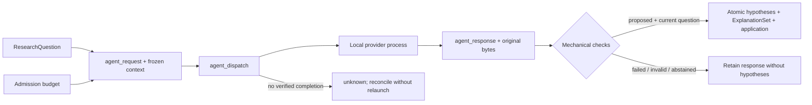

# ADR 0007: задания модели и применение гипотез

Дата: 23 сентября 2026. Статус: первый реализованный срез M3; независимые Executor, Replication и Scientific Reviewer остаются дальнейшей работой.

## Решение

Модель возвращает предложение; CommandService применяет его к сохранённому ResearchQuestion. Первый task — `hypothesis_proposal`: 2–8 объяснений с null и non-null альтернативами либо явное abstention. Candidate содержит statement, prediction, falsifier и kind; ответ — reason, comparison_plan и limitations. Непустые поля и различные формулировки не доказывают научную состоятельность.

Пять новых event kinds имеют оригинальные command receipts. Request сохраняет question ID/hash, assignee, provider descriptor, prompt/context, schema, Python wrapper, inputs, runtime fingerprint и limits в CAS. Dispatch фиксируется до внешнего процесса. Вызов модели не держит SQL write lock. Повторный controller после dispatch может только импортировать исходный completion; отсутствие результата не разрешает новый вызов.

`agent.apply_hypotheses` повторно проверяет assigned actor, response и актуальность вопроса внутри транзакции. Новые hypotheses, root ExplanationSet и mapping создаются атомарно. Scope выводится из frozen question; модель не выбирает actor, IDs или команды ядра. Revision существующего ExplanationSet пока не поддерживается: для неё нужны явные причины исключения прежних кандидатов.

Исторические запросы выбирают prompt/schema/validator через append-only registry `agent_profiles.py`. Следующий контракт требует новой версии. Provider schema структурная; runtime validator дополнительно проверяет cross-field правила, содержательные дубликаты независимо от kind, null/non-null, UTF-8, duplicate keys и finite numbers.

## Исполнение и границы

Первый адаптер использует установленный Codex CLI и существующий login. Binary digest/version и model/effort фиксируются до admission и перепроверяются перед вызовом. Harness не читает credentials и не копирует их в CAS. `exec --json`, output schema и ephemeral session описаны в [официальной документации](https://learn.chatgpt.com/docs/non-interactive-mode); конкретные флаги проверены на локальном `codex-cli 0.153.4`.

Отдельный временный cwd находится вне проекта, frozen prompt передаётся через stdin. Фиксированный профиль отключает наследование user config, project instructions, memories и ряд features; security/permission rules сохраняются. Allowlist окружения исключает desktop/thread bridge variables и API keys, сохраняя OS paths и расположение login. Managed/system policy, общий аккаунт и ОС остаются доверенными. Ни feature flags, ни отдельный actor ID не доказывают отсутствие tools или независимость. JSONL audit отвергает наблюдаемые tool items, ошибки и неподдерживаемые события; он не может отменить уже выполненное действие.

Provider profile 2 сохраняет Code Mode runtime включённым: bundled descriptor GPT-6 Astra задаёт `tool_mode=code_mode_only`, даже когда feature list показывает `code_mode=false`. Известное startup предупреждение unstable features подавлено конфигурацией; произвольные error items по-прежнему блокируют application. Profile 1 и его frozen wrapper сохраняются исторически. Настройки описаны в [официальной schema](https://learn.chatgpt.com/docs/config-schema.json); итоговая доступность tools не выводится из одной feature list.

Общий low-level supervisor контролирует процесс, но model task не создаёт scientific Run/Protocol. Применяются Windows Job Object либо POSIX process group, wall timeout и bounded capture. Нет файлового/сетевого sandbox harness, disk quota или hard token ceiling. Прекращение локального процесса не доказывает прекращение remote billing. `read-only` — настройка CLI, не доказанная универсальная OS boundary.

`max_calls` ограничивает admission в одном immutable budget, включая queued, unknown и failed. Новый budget — отдельный лимит; глобальный study ledger ещё не реализован. Usage берётся из JSONL, сохраняется для invalid response и остаётся `null`, если неизвестен. Это не денежная оценка. Изменение ResearchQuestion до первого dispatch блокирует вызов; после dispatch ответ сохраняется, но application блокируется.

Authority marker вне DB/CAS необходим для нового dispatch. Restore не получает права запускать queued requests. Это защита от случайного запуска копии, не аутентификация или distributed lease: владелец файлов может скопировать marker.

## Provenance и следующие шаги

Graph связывает budget, request, dispatch, response, generated entities и CAS. Review basis включает происхождение использованных гипотез даже у legacy protocol, а также исключённых кандидатов из planning ancestry. Requester, assignee, budget owner и авторы исходного/предыдущих ResearchQuestion становятся contributors. Посторонний новый request не меняет basis старого claim.

`proposed` означает формальную допустимость ответа, `applied` — сохранение гипотез; оба оставляют `scientific_validity=not_assessed`. Claim, experiment, review и paper не создаются. [Проверки](../validation.md) отделяют synthetic fixtures от реального model call.

Следующие срезы: typed experiment proposals с domain adapter/preregistration; отдельные agent assignments/context bundles для Executor, independent reanalysis и Reviewer; исполнимые obligations/replanning после findings. Этот срез их не закрывает.
